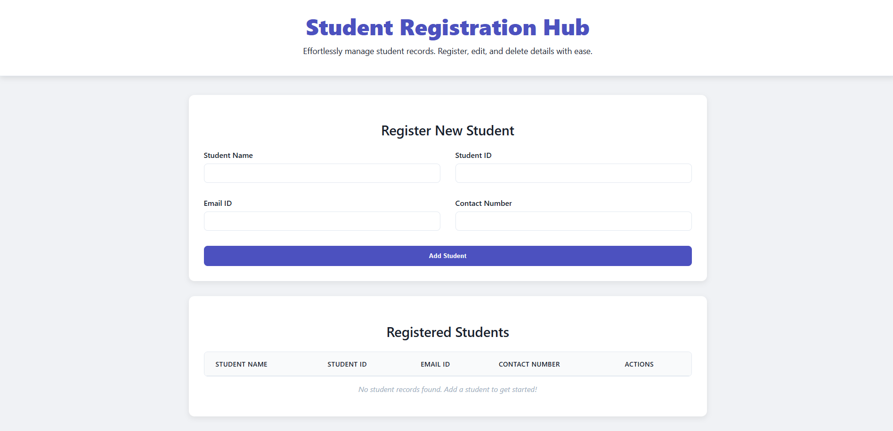

# Student Registration System

A web-based student registration system built with **HTML, CSS, and JavaScript (DOM Manipulation)**.  
This project allows users to register, edit, delete, and manage student records with data persistence using **Local Storage**.  

---

## Table of Contents
- [Overview](#overview)
- [Features](#features)
- [Technology Stack](#technology-stack)
- [Project Structure](#project-structure)
- [Installation & Usage](#installation--usage)
- [Functional Details](#functional-details)
- [Screenshots](#screenshots)
- [Future Enhancements](#future-enhancements)
- [Author](#author)

---

## Overview
The Student Registration System is designed to make it easy to add, update, and remove student details. It demonstrates:
- Form handling and validation
- DOM manipulation
- Responsive design
- Persistent storage in the browser

This project is part of an assignment focused on **JavaScript DOM Manipulation** and **Frontend Development best practices**.

---

## Features
- Register students with details: Name, ID, Email, Contact
- Edit existing student records
- Delete student records
- Persistent data storage using browser Local Storage
- Input validation:
  - Student Name → characters only
  - Student ID → numeric only
  - Email → valid email format
  - Contact Number → minimum 10 digits
- Responsive design for mobile, tablet, and desktop
- Dynamic vertical scrollbar when many records are added

---

## Technology Stack
- **HTML5** – Structure and semantic layout
- **CSS3** – Styling, layout, and responsiveness
- **JavaScript (ES6)** – DOM manipulation, validation, CRUD operations, Local Storage

---

## Project Structure
```

Student-Registration-System/
│── index.html     # Main HTML file (UI structure)
│── style.css      # CSS styles (design and responsiveness)
│── script.js      # JavaScript functionality (form handling, CRUD, validation)
│── README.md      # Project documentation

````

---

## Installation & Usage

### Step 1: Clone the Repository
```bash
git clone https://github.com/sumitghiyal/Student-Registration-System.git
````

### Step 2: Navigate to the Project

```bash
cd Student-Registration-System
```

### Step 3: Run the Application

Open `index.html` in a web browser.
No server setup is required.

---

## Functional Details

1. **Add Student**
   Fill in the form with details and click "Add Student". The record will be displayed in the table.

2. **Edit Student**
   Click the "Edit" button next to a record, update the details, and save changes.

3. **Delete Student**
   Click the "Delete" button to remove a record.

4. **Persistent Storage**
   Data is stored in Local Storage, ensuring it remains even after page refresh.

---

## Screenshots



---

## Future Enhancements

* Add search and filter functionality
* Export records as CSV or Excel
* Connect with a backend service (Node.js/Express + database)
* Add dark mode toggle

---

## Author

**Sumit Kumar**
New Delhi, India
Email: [sumitghiyal1999@gmail.com](mailto:sumitghiyal1999@gmail.com)
LinkedIn: [linkedin.com/in/sumitghiyal](https://www.linkedin.com/in/sumitghiyal)

---

